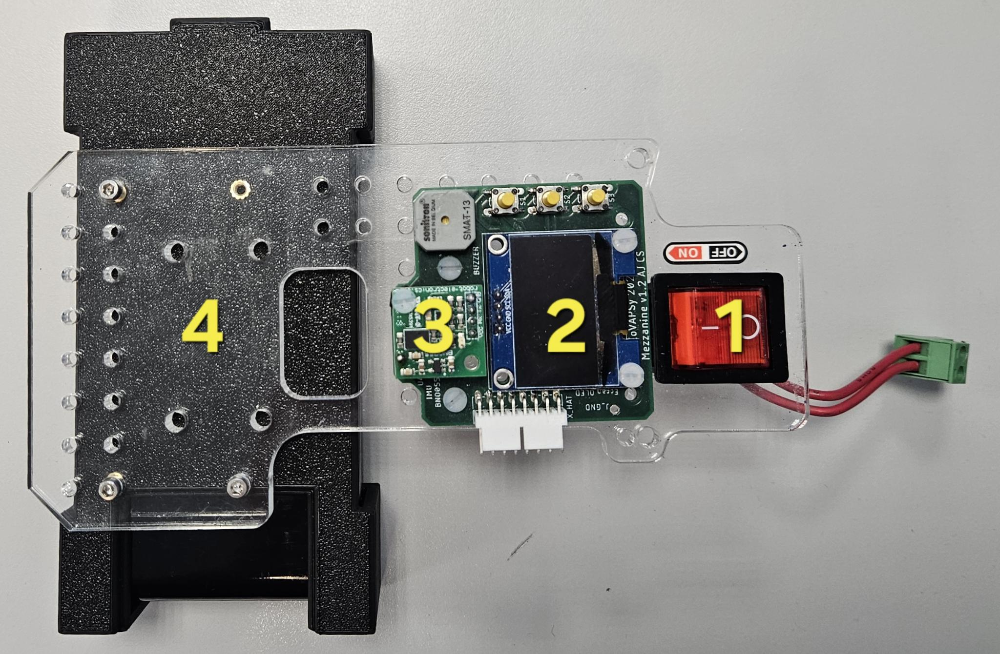
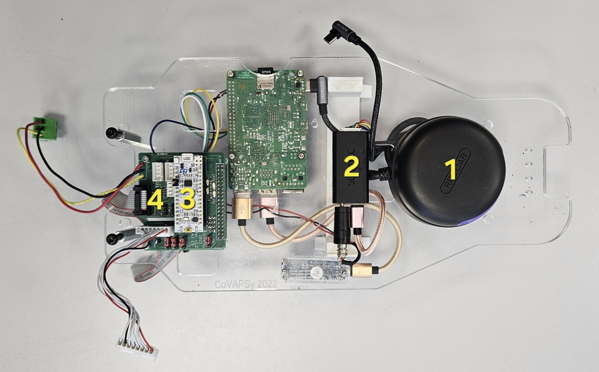
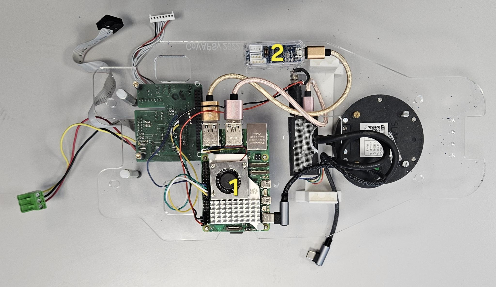
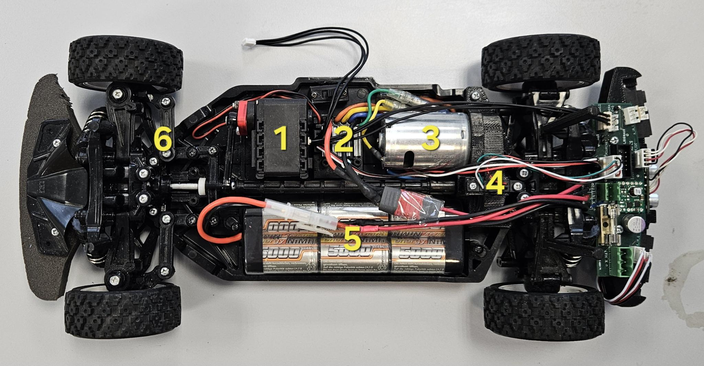
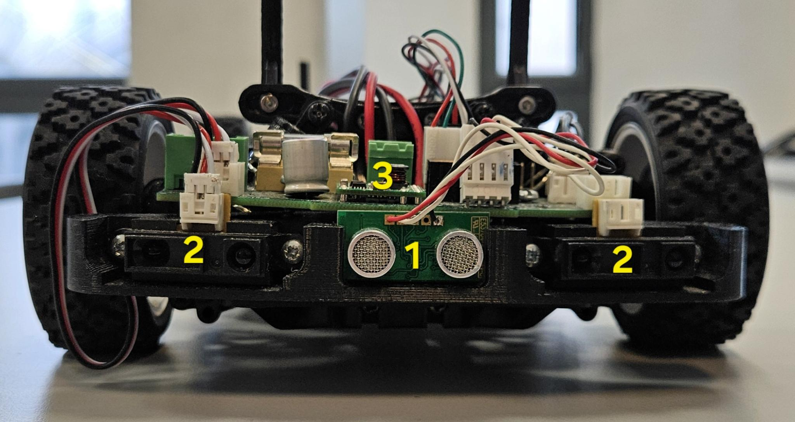

%TODO: marquer quels élements sont dans troubleshooting 
%TODO: angle de braquage max
# Architecture physique de la voiture

L’architecture physique de la voiture peut être divisée en trois étages :

- l’étage supérieur ;
- l’étage intermédiaire ;
- l’étage inférieur.

Cette organisation permet de séparer les éléments de supervision, de calcul embarqué, de puissance et de capteurs.

## L’étage supérieur

L’étage supérieur est le plus simple à identifier. Il est composé de 4 éléments principaux, ou 5 lorsque la caméra 3D est installée.



### 1. Switch de sécurité

Le switch de sécurité permet d’activer ou de couper l’alimentation de la carte STM32, des capteurs et des moteurs.

Toute cette partie est alimentée par la batterie moteur. En cas de problème, ce switch permet donc d’arrêter rapidement les éléments liés à l’actionnement et aux capteurs.

### 2. Écran de contrôle

L’écran affiche le nom de la voiture et sert aussi au diagnostic rapide.

Le bouton jaune situé en haut à droite permet de réinitialiser la STM32. Cela peut être utile lorsque :

- l’IMU renvoie des données incohérentes ;
- la voiture ne répond plus correctement ;
- la carte de contrôle doit être redémarrée sans couper toute l’alimentation.

### 3. IMU

L’IMU utilisée est un [BNO055](https://www.bosch-sensortec.com/products/smart-sensor-systems/bno055/).

Elle permet de mesurer :

- l’accélération ;
- la vitesse angulaire ;
- l’orientation du véhicule.

Elle est utilisée pour estimer l’orientation de la voiture, notamment le yaw. Dans l’implémentation actuelle, les données brutes sont lues sur le topic `/raw_imu_data`.

```{note}
Le champ exact à utiliser pour l’orientation dépend du type de message publié par le nœud IMU. Il est recommandé de préciser ici le type du message ROS si vous documentez aussi l’architecture logicielle.
```
Vous pouvez trouver le layout de la carte (ici)[https://github.com/SU-Bolides/Course_2025_ros2/blob/main/ressources/Electronic_ressources/Vehicle/Mezzanine_CoVASPSy_v1re2_Schema.pdf]


### 4. Batterie de l’ordinateur embarqué

Cette batterie alimente l’ordinateur embarqué indépendamment de la batterie moteur.

Cette séparation est pratique pour :

- éviter les interférences ou les coupures d’alimentation qui pourraient éteindre la Raspberry Pi ;

## L’étage intermédiaire

L’étage intermédiaire est divisé en deux parties :

- la partie supérieure ;
- la partie inférieure.

## La partie supérieure de l’étage intermédiaire

Cette partie est composée de 4 éléments visibles sur la photo suivante.



### 1. LiDAR

Le LiDAR utilisé est un [RPLIDAR A2M12](https://www.slamtec.com/en/lidar/a2).

Il permet de mesurer la distance entre la voiture et les obstacles autour d’elle. Il est utilisé pour la perception de l’environnement et les algorithmes de navigation réactive. Les données du LiDAR sont publiées sur le topic `/scan`.

On utilise pour ce capteur le package `sllidar_ros2`, lancé avec `sllidar_node`.

### 2. Adaptateur Slamtec

Cet adaptateur fait l’interface entre le LiDAR et l’ordinateur embarqué.

Il convertit la liaison du LiDAR vers une interface exploitable par la Raspberry Pi, il est relié :

- en micro-USB à la Raspberry Pi ;
- aux lignes d’alimentation nécessaires au fonctionnement du LiDAR.

### 3. STM32

La [STM32-L432KC](https://www.st.com/en/evaluation-tools/nucleo-l432kc.html) est le microcontrôleur chargé des fonctions bas niveau.

Son rôle principal est de :

- piloter le moteur de propulsion ;
- lire ou relayer certaines données capteurs ;
- recevoir les commandes provenant de l’ordinateur embarqué.

La communication avec la Raspberry Pi se fait en SPI. Le code de cette carte n’est pas entièrement disponible dans le Git actuel car l'étudiant qui s’en occupait a pas mis son code sur github il y a plusieurs années. Si vous avez besoin de reflash un stm32 allez voir la partie stm32 de troubleshooting.

### 4. HAT / carte d’interface

Le HAT sert d’interface matérielle entre plusieurs sous-systèmes :

- la Raspberry Pi ;
- la STM32 ;
- les capteurs ;
- les moteurs.

Son rôle est de centraliser les connexions et certaines liaisons de commande. C’est une carte de jonction importante dans l’architecture de la voiture.
Vous pouvez trouver le layout de la carte (ici)[https://github.com/SU-Bolides/Course_2025_ros2/blob/main/ressources/Electronic_ressources/Vehicle/Hat_CoVASPSy_v1re2_Schema.pdf].

---

## La partie inférieure de l’étage intermédiaire

Cette partie est composée de 2 éléments visibles sur la photo suivante.



### 1. Raspberry Pi

L’ordinateur embarqué est une **Raspberry Pi 5** avec **8 Go de RAM**.

Elle tourne sous **Ubuntu 24.04** avec **ROS 2 Jazzy**. C’est elle qui exécute les nœuds ROS 2 de la voiture et orchestre la partie haut niveau.


### 2. U2D2

L’U2D2 est un convertisseur **USB vers UART** utilisé pour communiquer avec le moteur de direction.

Il est relié :

- côté moteur de direction via la liaison TTL 3 broches ;
- côté Raspberry Pi en USB pour l’alimentation et la communication.


---

## L’étage inférieur

L’étage inférieur est le plus chargé. Il est séparé en deux sous-parties :

- la partie **puissance** ;
- la partie **capteurs**.

## La partie puissance

Cette partie est composée des éléments liés à l’alimentation et à l’actionnement.



### 1. Moteur de direction

Le moteur de direction pilote l’orientation des roues avant c'est un [ax-12a](https://emanual.robotis.com/docs/en/dxl/ax/ax-12a/).

Il reçoit ses commandes via la chaîne Raspberry Pi → U2D2 → liaison série TTL → actionneur de direction.

### 2. ESC

L’ESC (Electronic Speed Controller) pilote le moteur de propulsion c'est un [TBLE-04S](https://www.rcteam.com/products/tamiya-variateur-brushless-sensored-tble-04s-45069).

Il reçoit la commande de vitesse depuis l’électronique bas niveau. Vous pouvez trouver la documentation de ce composant (ici)[https://github.com/SU-Bolides/Course_2025_ros2/blob/main/ressources/Electronic_ressources/doc_ESC.pdf].
### 3. Moteur de propulsion

Le moteur de propulsion est un [Tamiya 540 Torque 25T Motor](https://www.rcteam.com/en/products/tamiya-540-torque-25t-motor-54358).

Il est commandé par l’ESC, lui-même piloté par le stm32 lui même commandé par la raspberry pi.

### 4. Fourche optique

La fourche optique sert à mesurer la rotation ou la vitesse. C'est une [OPB015L](https://www.ttelectronics.com/TTElectronics/media/ProductFiles/Datasheet/OPB815.pdf).


### 5. Batterie moteur

La batterie moteur alimente la partie puissance de la voiture, notamment :

- l’ESC ;
- le moteur de propulsion ;
- la STM32 ;
- une partie des capteurs et actionneurs associés à la chaîne de puissance.

Elle est distincte de la batterie qui alimente l’ordinateur embarqué. Ce sont des batteries NiMH de 7.2-8.4 V, avec une capacité d’environ 5000 mAh.

### 6. Mécanisme de direction

Le mécanisme de direction transforme la commande du moteur de direction en angle de braquage au niveau du train avant.

Cette partie est purement mécanique, mais elle est directement liée à la qualité de la commande envoyée depuis la chaîne logicielle.

---

## La partie capteurs

Cette partie regroupe les capteurs de proximité installés sous la voiture.



### 1. Capteurs ultrason

Les capteurs ultrason mesurent la distance à certains obstacles proches. C'est un 

Le topic `MultipleRange` contient notamment une mesure sonar, même si la documentation précise qu’elle n’est pas utilisée pour le moment.

### 2. Capteurs infrarouges

Les capteurs infrarouges mesurent des distances de proximité.

D’après les dépôts SU-Bolides, le message `MultipleRange` contient plusieurs mesures de distance, en particulier pour les capteurs infrarouges arrière gauche et arrière droit.

### 3. Convertisseur 5 V

Le convertisseur 5 V sert à abaisser ou stabiliser la tension nécessaire pour certains capteurs ou cartes électroniques.

Il permet d’alimenter correctement les composants qui ne fonctionnent pas directement à la tension batterie.

---

## Résumé

L’architecture physique du bolide repose sur une séparation claire entre :

- les éléments de supervision et de sécurité ;
- l’ordinateur embarqué ;
- les interfaces de communication ;
- la chaîne de puissance ;
- les capteurs de perception et de proximité.

Cette organisation facilite :

- la maintenance ;
- le diagnostic ;
- le développement logiciel ;
- le remplacement des composants ;
- la compréhension globale du système.
