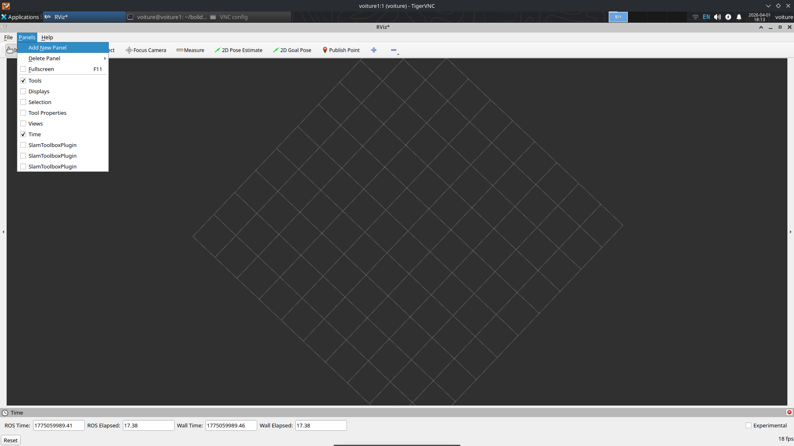
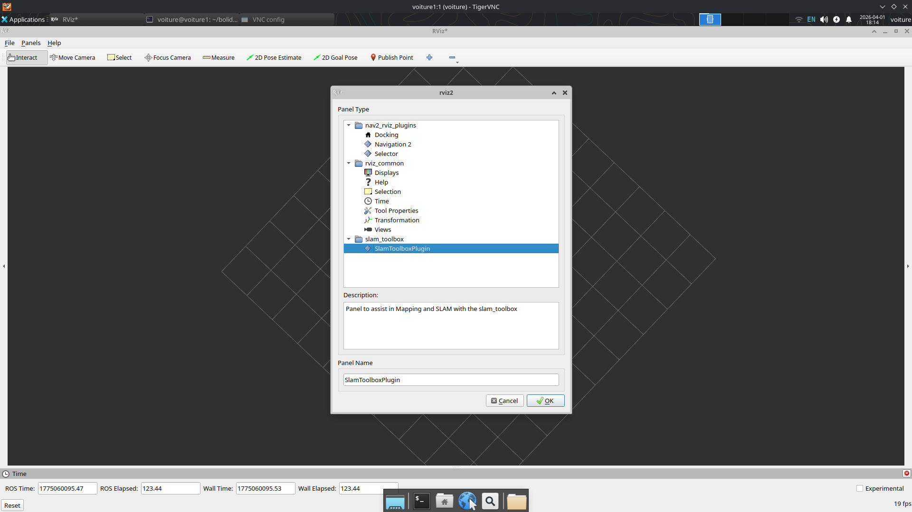
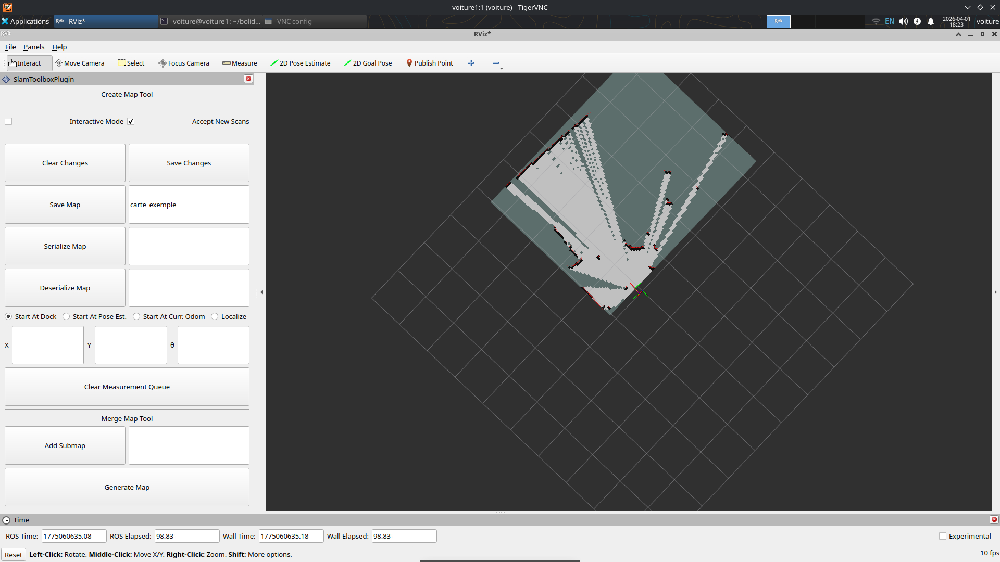
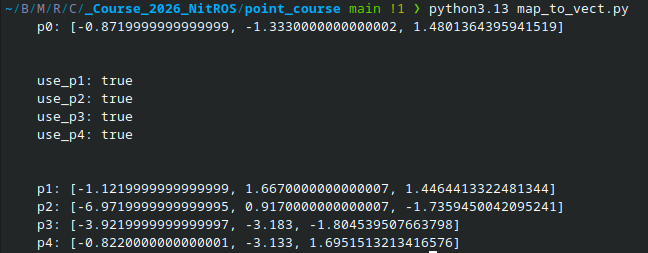

# Procédure de course

## Création de la carte

Ouvrez une vnc sur la raspberry: 
[Tutoriel dans quick start](../Connexion_voiture/Connexion_voiture.md)

Ouvrez un terminal dans la vnc et écriver 

```bash
rviz2
```

Puis dans 3 terminaux different en ssh depuis votre pc lancez : 
```bash
ros2 launch bolide_teleop sensors.launch.py

ros2 run bolide_teleop teleop_keyboard

ros2 launch slam_toolbox online_async_launch.py
```

Faites le tour de la piste en teleopération puis dans rviz2 

Cliquez sur Add New Panel


Cliquez sur SlamToolBox_Plugin



Ecrivez le nom de la map, cliquez sur Save Changes puis Save Map 


Pour vérifier que la map est bien sauvegarder, regardez dans le fichier ~/bolide_voiture si il y a votre map (deux fichier en format .yaml et .pgm).

Si la map n'est pas sauvegarder, recliquer plusieurs fois sur Save Map.

Déplacer la map dans ~/bolide_voiture/maps

Modifier la map si elle est moche sur une application de votre choix (gimp ou autre).

## Création des points de trajectoire

Télécharger dans le ([Github](https://github.com/SharaineMALARVIJY/Course_2026_NitROS/tree/main/point_course)) le fichier point_course.

Copier ensuite votre map dans ce fichier et changer le path dans map_to_vect.py et affichage.py.

Lancer le dans votre terminal
```bash
python map_to_vect.py
```

1. Cliquer une fois pour la position puis un deuxième pour l'orientation.
2. Recommencez l'etape 1. pour avoir 4 ou 5 points sur la map.
3. Fermez la carte.

Vous devriez voir ceci :


Notez que p0 est uniquement le point initial et la trajectoire ne sera passera que par les points p1 à p4

Coller le résultat dans le fichier race_params.yaml de la raspberry pi 

Et ajoutez les points dans affichage.py et lancez le pour vérifier les points.

## Lancement de nav2

Lancez dans 4 terminaux (n'oubliez pas de changer le nom de la map):

```bash
ros2 launch bolide_teleop sensors.launch.py

ros2 launch nav2_bringup localization_launch.py \
  map:=/home/voiture/bolide_voiture/maps/map_etage_2_cleaned.yaml \
  params_file:=/home/voiture/bolide_voiture/config_nav2/amcl_params.yaml

ros2 launch nav2_bringup navigation_launch.py \
  params_file:=/home/voiture/bolide_voiture/config_nav2/nav2_params.yaml

ros2 run race_path_follower race_node --ros-args --params-file /home/voiture/bolide_voiture/config_nav2/race_params.yaml
```

Vérifier la pose initial sur rviz2 et changez p0 dans race_params.yaml si nécessaire. 

Fermer rviz2 puis la vnc (pour avoir plus de performance sur la raspberry pi)
```bash 
vncserver -kill
```

Vous pourrez lancer la voiture depuis le terminal de race_node.


